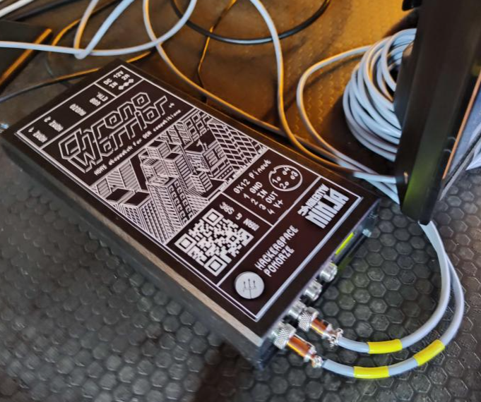
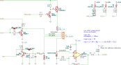
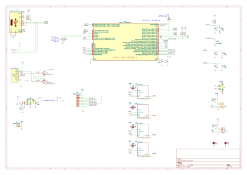

# Outduino

This is a board we did back in 2023, for our ninja warrior timer.

The core requirements of the projects were - create a device that would:
* drive 2 HDMI outputs (for timer output)
* Register inputs from large switches, on very long cables
* Flash LED outputs.

At first we considered adding some I/O buffer circuitry to raspberry pi, but we decided that a cheaper and more reliable version (if not the more interesting one!) would consist of a Dell Wyse 3040 hidden inside a case, and having a standalone, overengineered, ESP-based IO module drive and read Inputs/Outputs. This is how Outduino was made.

## I/O block

The device contains 4 overengineered blocks of I/O. These should be able to handle very long cables, as long as the peripherals are not going across different electrical phases. This installation was used outdoor, so this is fine.

As I'm writing this, the year is 2026, I'm 3 years wiser, and I'd probably go full galvanic isolation for both input (optocoupler) and output (something like B0505S isolated converter).

## ESP32

The board connects via USB, and uses very simple API via serial port, to control I/O from software running on host machine.

This part worked well.

In future, the board could've been made to work wirelessly. There's even a footprint for CC1101 sub-ghz wireless IC connection. These functionalities were never added to the firmware.

## Thank yous

Thank you LiquidLemon, not7cd, for inviting me to the project.

[Project website](https://hsp.sh/chronowarrior)

## License

Copyright 2023 Jakub "cr1tbit" Sadowski.

* **Hardware** (KiCad sources, production files and this documentation) is
  licensed under the [CERN-OHL-P v2](LICENSE) (permissive). You may
  redistribute and modify it and make products using it under the terms of
  that licence.
* **Firmware** in [outduino-fw/](outduino-fw/) is licensed under the
  [MIT License](outduino-fw/LICENSE).

This source is distributed WITHOUT ANY EXPRESS OR IMPLIED WARRANTY, INCLUDING
OF MERCHANTABILITY, SATISFACTORY QUALITY AND FITNESS FOR A PARTICULAR PURPOSE.
Please see the CERN-OHL-P v2 for applicable conditions.

Symbols and footprints from the KiCad and Espressif libraries embedded in the
design files remain under their respective licences.
